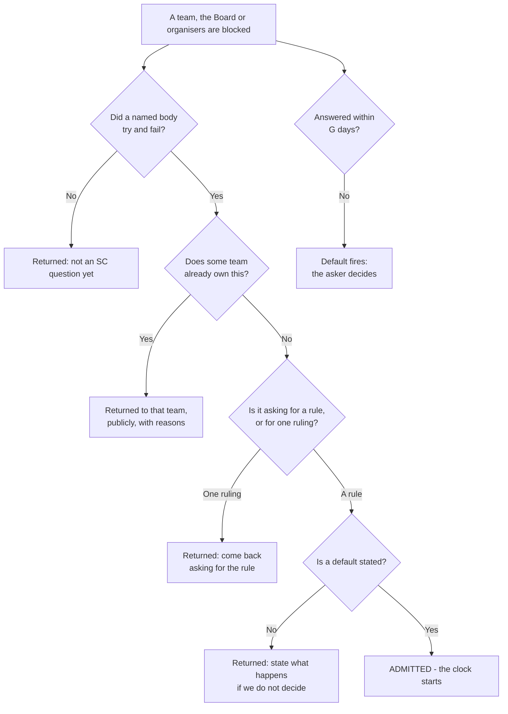
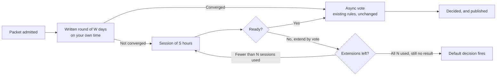
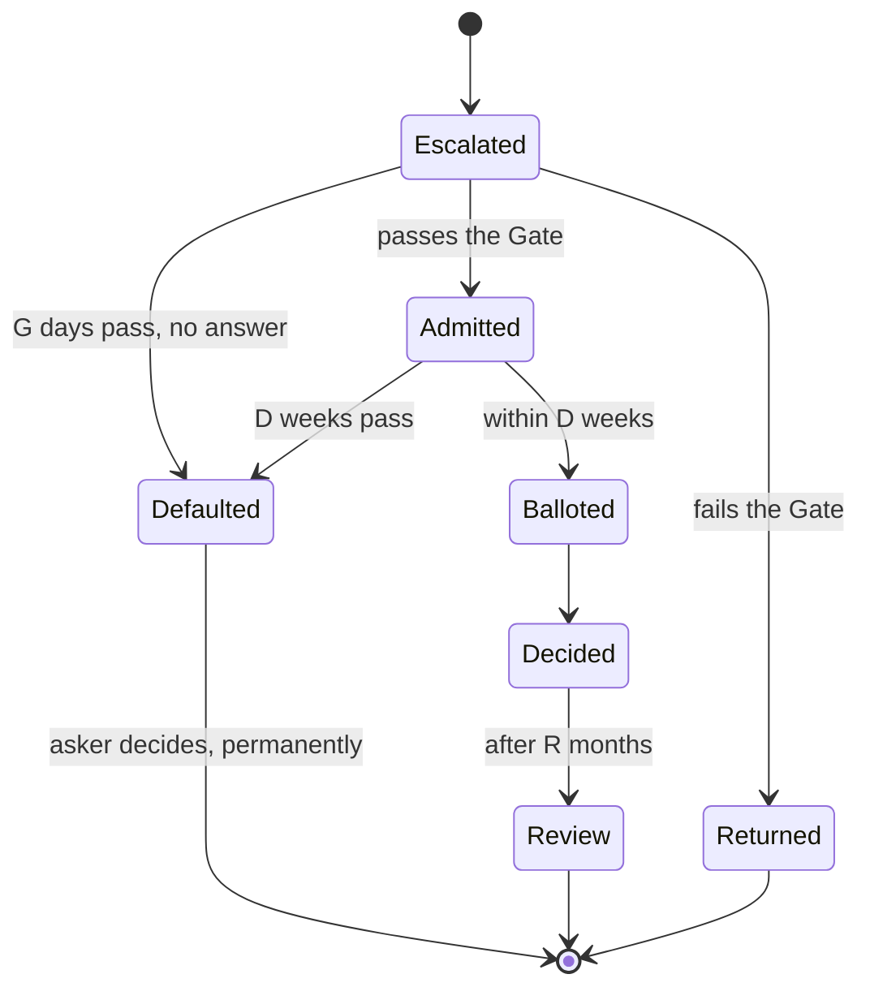

# Decision Process

> Reasoning, evidence, and objections: [the proposal](../proposals/decision-process.md).
> This document is rule text only. It does not change [async-voting.md](./async-voting.md),
> which governs how a vote is run and which this process hands off to unchanged.

---

## 0. Dials

Every number in this process is a named variable, defined here and used as a symbol everywhere
below. Values appear in this table and nowhere else.

| Symbol | Dial | Unit | Value |
| :---: | --- | :---: | :---: |
| **N** | Sessions before the Default fires | sessions | 3 |
| **S** | Length of one session | hours | 1 |
| **G** | Chairperson's answer window at the Gate | days | 7 |
| **W** | The written round | days | 7 |
| **D** | From admitted packet to ballot | weeks | 3 |
| **P** | Publishing each round's outcome | days | 7 |
| **R** | How long a decision stands | months | 12 |
| **T** | Review interval for this process | months | 3 |

Each symbol is a bare number, and its unit never changes. Every rule below repeats that unit:
"within **G** days", "**N** sessions of **S** hours", "stands for **R** months", so you never
have to look a value up to read a rule.

**Total committee time per question is N × S hours.**

*Why the numbers are what they are: [the proposal][p-dials].*

---

## 1. Scope: what is SC work

1. A question is SC work if it was **escalated through the Gate** ([§3](#3-the-gate)) and
   admitted.
2. Or if it is on this **closed list** of things the SC may put on its own agenda:
   - elections, seats, and vacancies;
   - coordination with the Foundation Board;
   - chartering teams, and appointing or removing the person responsible for one;
   - the SC's own process rules.
3. **Anything else is not SC work.** If it did not come through the Gate and is not on the list
   above, the SC does not take it up.

*Why this rule exists, and what it takes off the SC's plate: [the proposal][p-stops].*

---

## 2. Who may ask

1. **The asker is a body, not a person**: a team, the Board, event organisers, or a chartered
   working group. It escalates through the one person responsible for it, so there is always one
   name attached and one place the answer goes back to.
2. **Individuals cannot escalate on their own.** If you are not part of the group that has to
   live with the answer and do the work that follows it, the SC is not where your question
   belongs. Convince the people who do that work first.
3. **If a body's responsible person refuses to escalate**, that is not an escalation about the
   topic. It is a question about whether the right person is responsible, which is on the closed
   list in [§1](#1-scope-what-is-sc-work).
4. Every other avenue is unaffected: issues, pull requests, Discourse, Zulip, and joining a
   team. This section governs only what can *compel* SC time.

This process requires only that each body has **one name** who escalates on its behalf and
receives returned questions. What authority that person holds, how they are appointed, and how
they are removed is set out in [team-charters.md](./team-charters.md).

*Why the right to escalate is tied to doing the work: [the proposal][p-who].*

---

## 3. The Gate

A question reaches the SC only if it passes four tests. **All four.**

The **chairperson** (the SC's existing rotating role, picked at each meeting) answers within
**G** days, in public, with a written reason. The chairperson in place when an escalation arrives
answers it, and remains responsible for that answer after handing over. **Any two SC members can
overturn a rejection.**

**If no chairperson is in place, or none answers within G days, the asker's stated default takes
effect** and authority over that class of question returns to them, exactly as in
[§6](#6-the-default). Appointing a chairperson is the SC's own duty under
[§1](#1-scope-what-is-sc-work); failing to do it is not a reason the asker waits.

1. **A named body is blocked.** A team, the Board, or an event's organisers tried to decide and
   could not, and says so in writing through the person responsible for it.
   *Not:* an individual is unhappy with an outcome.
2. **Nobody else may decide it.** The question crosses team boundaries, or no team owns it. If a
   team does own it, the SC hands it back and says so publicly.
3. **It asks for a rule, not a ruling.** The answer must settle this case *and the next ten*. If
   the SC has already ruled on this class of question, the individual case is inadmissible. Only
   "change the rule" may be escalated.
4. **The asker states a default.** What should happen if the SC fails to decide in time. No
   default written down, no admission.

*Why a gate is needed at all, and what happens without one: [the proposal][p-f1].*

---

## 4. The Packet

A question is not admitted as a *topic*. It is admitted as a **decision packet**, written by
whoever is escalating it.

| Section | What it contains |
| --- | --- |
| **The question** | One sentence. |
| **Who is blocked** | Who is affected, and what cannot proceed today. |
| **The options** | **2 to 4 concrete options, each already written as motion text** the SC could vote on word for word. |
| **The trade-offs** | What each option costs and breaks, honestly, in the asker's own words. |
| **The default** | What happens if the SC does not decide by the deadline. |

1. The SC's job is to **pick, amend, or reject**, never to draft from a blank page.
2. **An incomplete packet is returned by the chairperson, not queued.** Returning it is a Gate
   answer and is subject to the same **G** day limit.

See the [template](#appendix-packet-template) for a complete packet.

*Why the work sits with the asker: [the proposal][p-packet].*

---

## 5. The Clock

Members respond to a packet in writing, on their own time. Meetings happen only if writing did
not settle it.

1. **The written round lasts W days.** If it converges, the motion goes straight to the existing
   async vote and there is no meeting at all.
2. **Ceiling: N sessions of S hours, within D weeks.** That is **N × S hours of committee time
   per question, total.**
3. Sessions after the first happen only if the SC explicitly extends, **by recorded vote**, and
   each extension is logged.
4. **The last session, session N, is final wording only.** The framing is not reopened.
5. **Absence does not stop the clock, and does not reopen settled text.** If you miss a session,
   you give up the right to reopen what was settled in it. You keep every other right, including
   your vote.
6. The motion then hands off to [async-voting.md](./async-voting.md), unchanged.

*Why discussion needs an end condition: [the proposal][p-f2].*

---

## 6. The Default

The default that the asker wrote down **takes effect automatically** in either of two cases:

1. **The Gate is not answered within G days**, including when no chairperson is in place
   ([§3](#3-the-gate)).
2. **D weeks pass after admission with no decision** ([§5](#5-the-clock)).

Authority over that class of question returns to the asker permanently. The log records:

> **SC did not decide.** Authority returns to *[the asker]*. Participation: *[per member]*.

*Why deadlock has to be made impossible rather than discouraged: [the proposal][p-f3].*

---

## 7. The Record

1. Every admitted packet gets a **public file from day one**: question, asker, options, default,
   deadline, and each round's outcome. The record is written as the work happens.
2. Each round's outcome is published within **P** days.
3. Every member's position and vote is public, with their reason.
4. **Four things may be withheld**, and nothing else: individual moderation cases, legal advice,
   unannounced personnel matters, and contracts under negotiation. Each withholding is logged as
   a line item with a reason. **The existence of a withheld item is always public.**
5. Video recordings and verbatim transcripts are not required.

*Why the record has to be finite and comparable: [the proposal][p-record].*

---

## 8. Participation

1. **A written position counts exactly as much as attending.** Nobody is penalised for missing a
   call. The obligation is to say something, not to show up.
2. **Abstaining requires a one-line reason.** Without one it is recorded as *"abstained, no
   reason given."* Abstaining remains legitimate.
3. **Recusal remains legitimate**, but must be declared with a reason, and is recorded as a
   recusal rather than as an abstention.
4. **A capacity check** triggers automatically if a member misses final ballots on more than half
   of a quarter's decided questions. They publish a short note saying whether they are continuing
   or stepping back.
5. **This process cannot remove anyone.** Removal is a constitutional matter and lives outside a
   process rule the SC adopts by majority.

*Why silence is the one thing that gets penalised: [the proposal][p-participation].*

---

## 9. Standing and review

1. A decision **stands for R months**. Within that period it is not re-litigated because somebody
   dislikes the result.
2. Every decision carries an **automatic review after R months**.
3. Before then, reopening requires **passing the Gate again with genuinely new facts**.

*Why "good enough and reversible" beats "right": [the proposal][p-principles].*

---

## 10. Review of this process

This process is reviewed after **T** months, against the record it produces.

*The success criteria, and what should happen if they are not met: [the proposal][p-trial].*

---

## Appendix: packet template

Copy this shape.

> **Question:** May companies whose primary business is weapons or defense systems sponsor NixOS
> events and post jobs on our platforms?
>
> **Who is blocked:** NixCon organisers cannot answer sponsors without a rule. Moderators are
> making individual calls with no policy behind them. Two decisions have already been made
> case-by-case, in opposite directions, six months apart.
>
> **Option A.** *"NixOS platforms and events do not accept sponsorship or job postings from
> companies whose primary business is the manufacture of weapons or defense systems."*
>
> **Option B.** *"NixOS platforms and events accept sponsorship and job postings from any lawful
> company. Industry is not grounds for exclusion."*
>
> **Option C.** *"NixOS platforms and events apply one published, objective exclusion list.
> Companies not on it are accepted on the same terms as everyone else."*
>
> **Trade-offs:** A is predictable and loses some funding; part of the community will call it
> political. B is predictable and maximises funding; part of the community will be angry, loudly.
> C is the most work to maintain and the hardest to keep consistent, but it moves the argument to
> the list instead of to each company.
>
> **Default if the SC does not decide:** NixCon organisers apply their own written prospectus,
> and the SC does not review individual sponsors again.

[p-dials]: ../proposals/decision-process.md#the-numbers-are-dials
[p-stops]: ../proposals/decision-process.md#what-the-sc-stops-doing-and-what-it-gets-back
[p-who]: ../proposals/decision-process.md#why-only-bodies-may-escalate
[p-f1]: ../proposals/decision-process.md#failure-1-there-is-no-gate-so-the-sc-works-on-whatever-lands-in-front-of-it
[p-f2]: ../proposals/decision-process.md#failure-2-there-is-no-clock-so-discussion-has-no-end-condition
[p-f3]: ../proposals/decision-process.md#failure-3-not-deciding-is-free-so-it-is-what-happens
[p-packet]: ../proposals/decision-process.md#1-elected-judgment-is-the-scarce-resource-spend-it-dont-waste-it
[p-record]: ../proposals/decision-process.md#a-record-a-voter-can-actually-check
[p-participation]: ../proposals/decision-process.md#objections
[p-principles]: ../proposals/decision-process.md#two-principles
[p-trial]: ../proposals/decision-process.md#adoption-and-trial-terms
